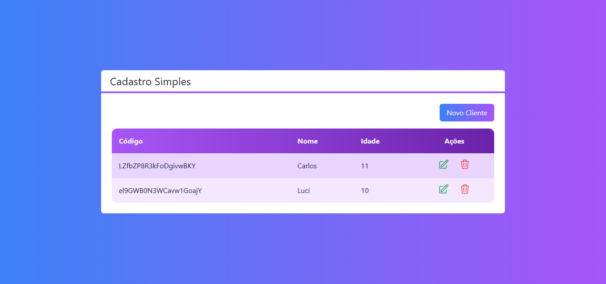

# Next CRUD
CRUD de usuários com Next e Firestore. Feito durante o curso de Next.js & React da Cod3r.



## ✨ Tecnologias
React | Next | TypeScript | TailwindCSS | Firebase

## 💻 Uso
Em seu terminal:
```bash
# Clone o repositório
git clone https://github.com/ViGF/next-crud.git
# Acesse a pasta do projeto
cd next-crud
# Instale as dependências
yarn add
#Adicione as variáveis de ambiente
#Na raiz do projeto crie um arquivo chamado .env.local, nele adicione as seguintes informações:
NEXT_PUBLIC_FIREBASE_API_KEY = Chave da sua API do seu projeto do Firebase
NEXT_PUBLIC_FIREBASE_AUTH_DOMAIN = Domínio de autenticação do seu projeto do Firebase
NEXT_PUBLIC_FIREBASE_PROJECT_ID = Id do seu projeto do Firebase
# Execute a aplicação
yarn dev
#Agora basta acessa-la
```

<div align="center">
  <small>Desenvolvido por Vitório Gomes - Dezembro/2022</small>
</div>